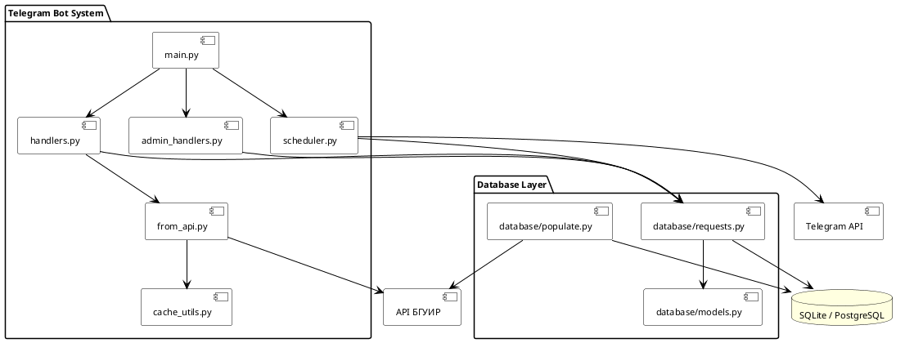
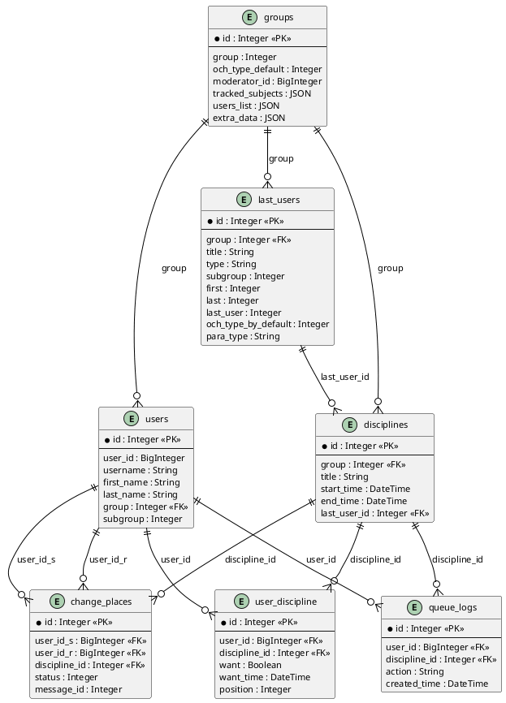

# Курсовой проект · Система очерёдности ответов на базе Telegram-бота

> Пояснительная записка курсового проекта по ООП-проектированию: объектно-ориентированный анализ и проектирование Telegram-бота, который ведёт очередь ответов на лабораторных и сам подтягивает расписание из API БГУИР.


---

## 📖 Описание

Это **пояснительная записка курсового проекта** (4-й семестр, БГУИР, дисциплина по объектно-ориентированному программированию и проектированию). Тема -- объектно-ориентированный анализ и проектирование интегрированной системы управления учебным процессом на базе Telegram-бота: система ведёт очередь ответов студентов на лабораторных занятиях, автоматизирует ротацию и замены, а расписание получает напрямую из официального API ИИС БГУИР.

Репозиторий -- это сам документ: исходники на **LaTeX**, UML-диаграммы (диаграммы вариантов использования, классов, последовательности, состояний, активности, развёртывания), экономический расчёт и собранный `note.pdf`. Проектируемая в записке система реализуется на Python (aiogram 3.x, SQLAlchemy, APScheduler) -- здесь описаны её анализ, проектирование и обоснование.

> ⚠️ Записка собрана на основе открытого LaTeX-шаблона курсовой БГУИР; содержание (тема, анализ, проектирование, диаграммы) -- авторское.

---

## 💡 Как появилась идея

Ручное ведение очереди ответов на лабораторных -- это вечная боль: преподаватель записывает, кто за кем, студенты спорят о порядке, замены и пропуски всё ломают. При этом Telegram уже стоит у каждого студента, а у БГУИР есть открытый API с расписанием. Напрашивалось решение: не плодить ещё одно приложение, а сделать бота, который берёт на себя и очередь, и напоминания о парах, опираясь на реальное расписание. Курсовой проект -- это полный объектно-ориентированный разбор такой системы: от анализа предметной области и аналогов до проектирования классов и оценки экономики.

---

## 🛠 Технологический стек

| Технология | Для чего используется |
|------------|-----------------------|
| LaTeX | Вёрстка пояснительной записки по СТП БГУИР |
| latexmk + Docker | Воспроизводимая сборка PDF с кириллическими шрифтами |
| UML (Rational Rose) | Диаграммы анализа и проектирования |
| PlantUML | Часть диаграмм (`.puml` → `.png`) в исходниках |
| BibTeX | Список литературы (`bibliography_database.bib`) |

**Проектируемая в записке система** (предмет анализа): Python, aiogram 3.x, SQLAlchemy (async), APScheduler, интеграция с API ИИС БГУИР.

### ⭐ Что необычного

| Решение | Что даёт |
|---------|---------|
| **Сборка в Docker** | `Dockerfile` + `Makefile` ставят TeX Live и кириллические шрифты -- PDF собирается одинаково на любой машине, без «у меня не компилится» |
| **Диаграммы как код** | PlantUML-исходники (`.puml`) лежат рядом с картинками, диаграммы версионируются вместе с текстом |
| **Раздельные секции** | Каждая глава -- отдельный `.tex`, что упрощает правки и ревью по частям |

---

## ✨ Что внутри

- 📑 **Полная пояснительная записка** -- введение, анализ, теория, проектирование, разработка, тестирование, руководство, экономика, заключение
- 🧩 **UML-диаграммы** -- вариантов использования, классов, последовательности, состояний, активности, компонентов, развёртывания
- 🗄 **Проект базы данных** -- ER-диаграмма системы (`database.puml` / `.png`)
- 📊 **Экономический расчёт** -- отдельные `.tex` с исходными данными, макросами и вычислениями
- 📚 **Список литературы** -- управляется через BibTeX
- 🐳 **Docker-сборка** -- `Dockerfile` и `Makefile` для воспроизводимой компиляции PDF
- 📄 **Готовый `note.pdf`** -- собранный документ

---

## 🚀 Сборка PDF

### Вариант 1 -- Docker (рекомендуется)

```bash
git clone https://github.com/Gudi00/course-work-4sem.git
cd course-work-4sem/note/sources
make            # соберёт note.pdf внутри контейнера с нужными шрифтами
```

### Вариант 2 -- локальный TeX Live

Нужен дистрибутив TeX Live с поддержкой кириллицы (`latexmk`, `xelatex`/`pdflatex`, шрифты):

```bash
cd note/sources/note
latexmk -pdf note.tex
```

Промежуточные файлы сборки (`*.aux`, `*.log`, `*.fls`, ...) в репозиторий не попадают -- они в `.gitignore`.

---

## 📸 Диаграммы

В записке используются UML-диаграммы, построенные в Rational Rose и PlantUML:


*Пример: компонентная диаграмма системы*


*Проект базы данных системы*

> Полный набор диаграмм -- в `note/sources/note/diagrams/` и `note/sources/note/attachments/`.

---

## 💼 Как я использую этот проект

Это моя курсовая работа, которую я защищал по дисциплине ООП-проектирования. Записка служит полным проектным описанием системы очерёдности ответов -- на её основе строилась последующая программная реализация бота. Документ удобно пересобирать: правлю нужную секцию `.tex`, запускаю сборку -- получаю готовый PDF по требованиям СТП.

---

## 👥 Аудитория

Документ рассчитан на преподавателя-руководителя и комиссию, оценивающих курсовой проект, а также может быть полезен студентам БГУИР как пример оформления пояснительной записки по СТП и полного цикла ООП-проектирования: от анализа аналогов до диаграмм и экономического обоснования.

---

## ⚙️ Структура записки

```
note/sources/
├── Dockerfile, Makefile        # воспроизводимая сборка PDF
└── note/
    ├── note.tex                # корневой документ
    ├── preamble.tex, macros.tex
    ├── sections/
    │   ├── 00_introduction.tex
    │   ├── 01_analysis.tex (+ sources / analogues / specification)
    │   ├── 02_theory.tex
    │   ├── 03_design.tex
    │   ├── 04_development.tex
    │   ├── 05_testing.tex
    │   ├── 06_manual.tex
    │   ├── 07_economics*.tex
    │   ├── 0A_conclusion.tex
    │   └── 0B_references.tex
    ├── diagrams/               # PlantUML (.puml) + рендеры (.png)
    ├── attachments/            # UML-диаграммы, скриншоты аналогов
    ├── bibliography_database.bib
    └── note.pdf                # собранный документ
```

---

## 🧗 Трудности при разработке

### Кириллица и шрифты в LaTeX

Главная головная боль любой записки на LaTeX -- заставить кириллицу и нужные шрифты собираться одинаково на разных машинах. Решением стала сборка в Docker с заранее установленными шрифтовыми пакетами: PDF собирается воспроизводимо, без ручной возни с локальным TeX Live.

### Согласованность диаграмм и текста

UML-диаграмм много, и при правках легко получить рассинхрон между картинкой и описанием в тексте. Хранение PlantUML-исходников рядом с записанным результатом помогло держать диаграммы под версионным контролем и пересобирать их вместе с документом.

---

## 🔮 Планы развития

- Довести программную реализацию описанной системы до полноценного бота
- Перенести оставшиеся диаграммы из Rational Rose в PlantUML, чтобы весь визуал был «как код»
- Настроить CI, который собирает `note.pdf` из исходников при каждом пуше

---

## 📄 Лицензия

Текст и диаграммы -- авторская работа, распространяется по лицензии **MIT** (см. [LICENSE](LICENSE)). Используемый LaTeX-шаблон оформления заимствован из открытого шаблона курсовых работ БГУИР и принадлежит его авторам.

```
MIT License © 2026 Gudi00
```
